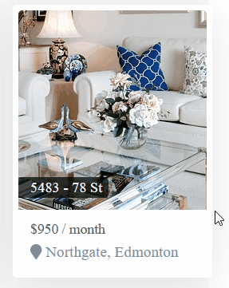
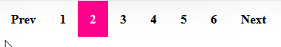

# Real Estate
A  real estate website project built with React, based on [`Joe Santos Garcia`](https://github.com/codingphasedotcom)'s tutorials.

# Show Case






# Getting Started
1. Install using the `npm install` command.
2. Install [@fortawesome/free-solid-svg-icons](https://github.com/FortAwesome/react-fontawesome) by running `npm i @fortawesome/fontawesome-svg-core`
3. Start the web server `npm run watch`
4. Go to [http://localhost:3000/](http://localhost:3000/) in your browser.


# Dependencies
See [package.json](package.json)
 - Node JS 12
 - [@fortawesome/free-solid-svg-icons](https://github.com/FortAwesome/react-fontawesome)
 - webpack
 - browsersync
 - node-sass
 - react
 - gulp
 - bable

 # Description
 ```bash
├─── docs # documentations
├─── assets # React and SASS files
│   ├─── js/realEstate # the web application
│   │         ├─── data # simulated database 
│   ├─── sass # sass stylesheets for the app
│   │
├─── public # React and SASS generated static assets
 ```

